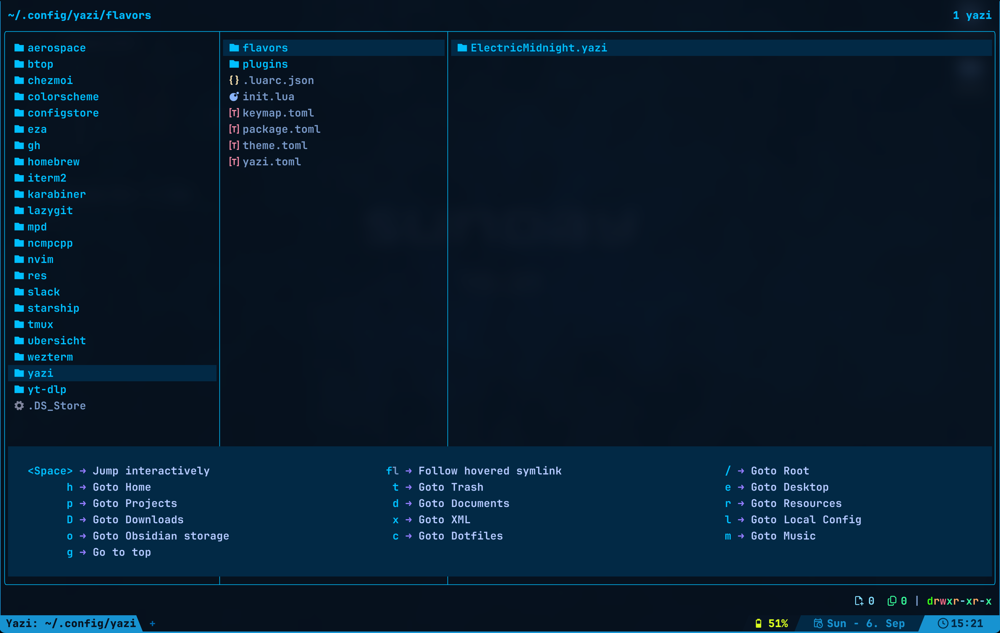

<h3 align="center">
	Electric Midnight - A flavor created by my self for <a href="https://github.com/sxyazi/yazi">Yazi</a>
</h3>

## 👀 Preview



## 🎨 Installation

```sh
ya pkg add splixx05/ElectricMidnight
```

## ⚙️ Usage

Set the content of your `theme.toml` to enable it as your _dark_ flavor:

```toml
[flavor]
dark = "ElectricMidnight"
```

Make sure your `theme.toml` doesn't contain anything other than `[flavor]`, unless you want to override certain styles of this flavor.

See the [Yazi flavor documentation](https://yazi-rs.github.io/docs/flavors/overview) for more details.

## 📜 License

The flavor is MIT-licensed, and the included tmTheme is also MIT-licensed.

Check the [LICENSE](LICENSE) and [LICENSE-tmtheme](LICENSE-tmtheme) file for more details.
